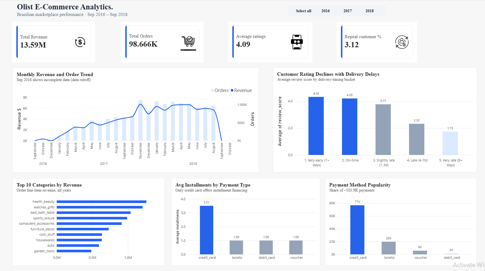

# Olist E-Commerce Analytics: SQL + Power BI



## Overview
End-to-end analysis of about 100K orders from Olist, a Brazilian online marketplace (Sep 2016 to Sep 2018). The raw relational data is loaded into PostgreSQL with an explicit schema, analyzed with SQL (CTEs, window functions, JOINs, CASE bucketing), and presented in a single-page Power BI dashboard with a Year filter.

All monetary values are in Brazilian reais (R$).

## Data Source
[Olist Brazilian E-Commerce Dataset](https://www.kaggle.com/datasets/olistbr/brazilian-ecommerce) on Kaggle. Seven tables are used: customers, orders, order_items, order_payments, order_reviews, products, and the category name translation table. The raw CSVs are not included in this repo because of their size.

## Tools
- **PostgreSQL 18**: schema design (typed columns, primary and foreign keys) and all analysis queries
- **Python (pandas, SQLAlchemy)**: CSV to PostgreSQL load script, plus upfront data profiling
- **pgAdmin 4**: writing and running queries
- **Power BI Desktop**: KPI cards, charts, and the Year slicer

## Key Findings

| KPI | Value |
|---|---|
| Total revenue | R$13.59M |
| Total orders (with line items) | 98.66K |
| Average review score | 4.09 |
| Repeat customers | 3.12% |

1. **Late deliveries sharply lower review scores.** Orders delivered on time or early average 4.29 stars, while late orders average 2.57. By delay bucket the score falls from 4.32 (7+ days early) to 1.73 (8+ days late).
2. **Very few customers come back.** Of 96,096 unique customers, only 2,997 (3.12%) placed a second order. Those who did waited about 80 days on average between their first and second order.
3. **Revenue grew through 2017 and plateaued in 2018.** It peaked in Nov 2017 at about R$1.01M (7,451 orders, likely Black Friday), then held between R$0.85M and R$1.0M a month through mid-2018.
4. **Installments are a credit-card-only feature.** Credit card is 74% of all payments (76,795) and averages 3.51 installments, while boleto, voucher, and debit card are always paid in one. Among credit card payments, average payment value rises from R$95.87 at 1 installment to R$415.09 at 10 installments.
5. **Health and beauty leads category revenue** (R$1.26M), followed by watches and gifts (R$1.21M) and bed, bath and table (R$1.04M).

## Dashboard Notes
- One page: KPI row, monthly revenue and order trend, delivery delay vs rating, top 10 categories, and two payment charts.
- The Year slicer filters the trend, delay, category, and payment charts through relationships on `order_id`. Repeat Customer % is an all-time figure.
- The revenue chart's last months look like a collapse, but they are the end of the dataset (only a handful of orders in Sep and Oct 2018), not a real drop. The chart subtitle says so.
- Month-over-month growth is only meaningful from Feb 2017. Late 2016 is distorted by the marketplace launch (and no orders at all in Nov 2016).

## Data Quality Notes
- Two product categories (`pc_gamer` and `portateis_cozinha_e_preparadores_de_alimentos`) are missing from the translation table. They are backfilled during load so the foreign key holds.
- About 610 products (1.9%) have no category and show as "Unknown" in the category chart.
- Null delivery dates belong to orders that were canceled or never delivered, so they are kept, not dropped.
- 551 order_ids have more than one review row. This is left as is because it barely moves the averages.
- About 18% of products (5,900 of 32,951) sold at more than one price. Any per-product ranking must first collapse to one row per product.
- The Total Orders card (98.66K) counts orders that have line items, so it is slightly below the 99,441 rows in the orders table.

## Recommendations
1. Find which regions and sellers drive late deliveries. The review-score drop is large enough to justify logistics investment.
2. Test a follow-up campaign timed around the roughly 80-day window before a customer's likely second order.
3. Plan inventory and marketing around a Black Friday style spike, as seen in Nov 2017.

## How to Reproduce
1. Install PostgreSQL and create a database: `CREATE DATABASE olist_ecommerce;`
2. Download the CSVs from Kaggle and put them next to the load script.
3. Install dependencies: `pip install sqlalchemy psycopg2-binary pandas`
4. Set your own password in `DB_CONFIG` inside `load_olist_to_postgres.py`, then run `python load_olist_to_postgres.py`
5. Run the queries in `queries/`. The `.pbix` in `dashboard/` was built against a local database named `olist_ecommerce`.

## Repository Structure
```
README.md
load_olist_to_postgres.py
queries/
    01_repeat_customer_analysis.sql
    02_delivery_delay_vs_review.sql
    03_monthly_revenue_orders.sql
    04_monthly_revenue_mom_growth.sql
    05_payment_behavior.sql
    06_category_performance.sql
    powerbi/
        delay_bucket_rowlevel.sql
        category_rowlevel.sql
dashboard/
    dashboard.png
    dashboard.pdf
    olist ecommerce visualization.pbix

```

## SQL Techniques Demonstrated
CTEs, window functions (`ROW_NUMBER`, `RANK`, `LAG`), `CASE WHEN` bucketing, `HAVING`, `FILTER (WHERE ...)`, `DATE_TRUNC`, interval arithmetic, `COALESCE`, and multi-table JOINs across a seven-table relational schema with enforced foreign keys.
